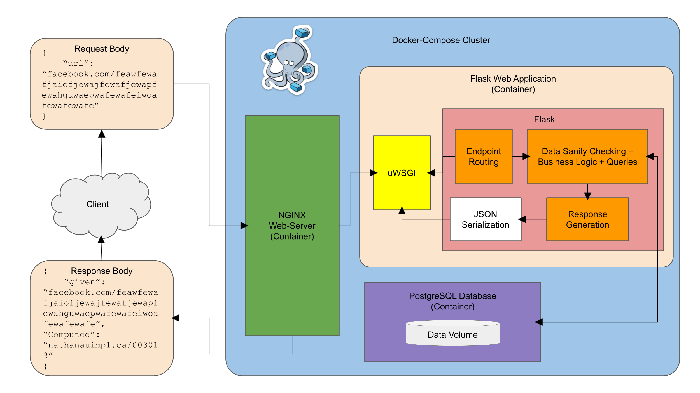

# YouuuuRL - A URL Shortener

## Python + Flask + PostgreSQL + Docker + NGINX + uWSGI :heart_eyes:

The goal of this is to be able to map a long sequence of characters (long url) into a short, 6-digit url.
Furthermore, we should be able to derive the long sequence (original url) from the shortened one.

Thus, a `bijective` function is needed to be able to go both ways.

## Candidate Solutions

* Hashing
* Base Conversion

My first thoughts were to attempt to use hashing to map each lengthy URL to a shorter URL. However, upon a little more thought, I realized that because there are so many URLs that could be cached into the system, it would be possible for collisions to occur, rendering this project completely useless. After performing a quick dive into the logic of most URL-compressors, I discovered that a very good approach to this would be to use Base Conversion.

### Base Conversion (Base 62)

Instead of using a bijective function to map between the shortened URL and the original, lengthy URL, a better alternative would be to first save the URL inside of a database with a certain unique number associated with it. This could be the row number (if using a relational database with tables), or just a randomly-generated UUID for non-relational databases. Using the row number, one would be able to quickly access the URL corresponding to it.

So on one hand, we have the **domain**, consisting of a random `n-digit` number. The codomain, on the other hand, would be the code converted into base 62. Here are some of the reasons why this base was chosen:

* There are 62 symbols that could be in the shortened code (numbers from 0-9, lower-case letters from a-z, and upper-case letters from A-Z). Thus, we can map each numerical value 0 to 61 to one of these symbols.
* This allows for several URLs to be stored. Since the code will be 6-digits and each digit will have 62 different possibilities, then we have a total of 62^6 possibilities AKA 62^6 possible URLs to be stored.

## Implementation

Here are some brief details describing the implementation of this project.

### Tech Stack

* Language: A LOT of Python and some SQL.
* Framework: Flask, a lightweight server-side framework for Python.
* Server-side: NGINX and uWSGI to follow proper server-side architecture.
* Containerization: Docker-compose to orchestrate several Docker containers together.
* Database: PostgreSQL, a common relational database.

Also, to practice applying Python in the actual industry, I included unit tests using Python's built-in module, `unittest`,for my custom utility classes to confirm their functionality. These can be found under the directory `flask/base_62_mapper/base_62_mapper_test.py` and `flask/string_utils/string_utils.py`

### System Design/Architecture



### Data Flow

This project is built using *Docker-Compose* to orchestrate three main components. The first is an *NGINX* Web Server. The server is responsible for providing many features including:

* Acting as a reverse-proxy to redirect user requests to a web-server gateway interface.
* Hiding the application server's IP to provide anonymity from attackers.
* Load-balancing using techniques such as Round-Robin Balancing, to circulate and spread user requests to other potential servers. This feature is not currently availalbe because I have not configured more than 1 server.

The second is the *Flask* application server. This is where the logic is defined for shortening/lengthening URLs.

The last is a *PostgreSQL* database for storing various URLs.

**Shortening the URL**: The URL that the user wants to shorten is sent as a request parameter to the endpoint `/v1/shorten`. The server then does a search in the *PostgreSQL* database to determine if there is a pre-existing shortened URL. If it does exist, then this is what is returned back to the user. Otherwise, it is added to the database as a new row,
the row number is returned, and converted into Base-62 before being transferred back to the user.

**Lengthening the URL**: The 6-digit sequence of characters appeneded to `nathanauimpl.ca/` is extracted and converted from Base-62 into decimal representation, which is the row number in the table within the database. The saved URL is then returned to the user.

## Endpoints

### Shorten URL

`/v1/shorten`: Given a long URL (up to 250 characters long), this shortens it and returns it in the form `nathanauimpl.ca/{code}`, where `{code}` is a 6-digit alphanumeric sequence of characters.

Sample Request

```json
{
    "url": "facebook.com/abcdafewewafefewafewafewafewafewafewafewafewafe"
}
```

Sample Response

```json
{
    "given": "facebook.com/abcdafewewafefewafewafewafewafewafewafewafewafe",
    "computed": "nathanauimpl.ca/0b03fc"
}
```

### Lengthen URL

`/v1/lengthen`: Given a shortened URL (generated by this service) in the form `nathanauimpl.ca/{code}`, this endpoint returns the original long URL.

Sample Request

```json
{
    "url": "nathanauimpl.ca/0b03fc",
}
```

Sample Response

```json
{
    "given": "nathanauimpl.ca/0b03fc",
    "computed": "facebook.com/abcdafewewafefewafewafewafewafewafewafewafewafe"
}
```

### Possible new features

Endpoints:

*`/v1/invalidate`: Removes an endpoint from the database that is no longer needed.

Features:

* Load Balancing with NGINX
